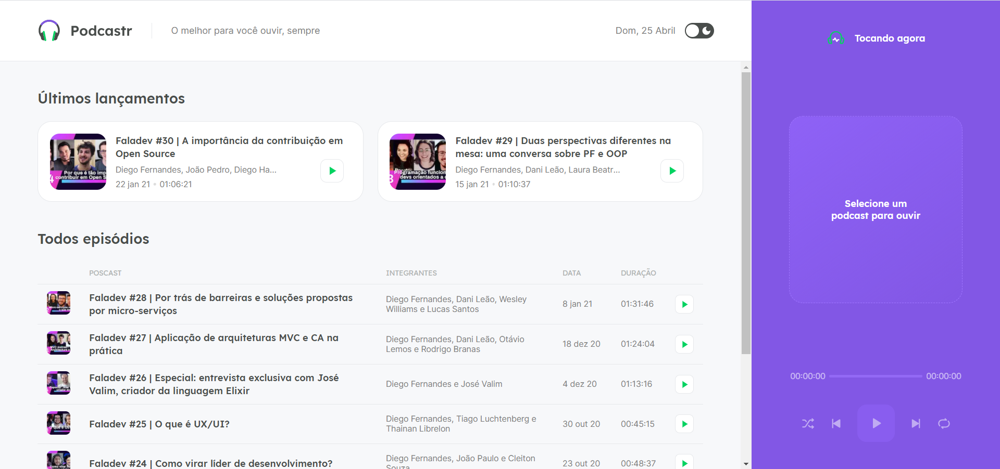
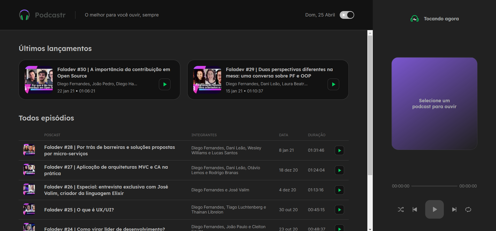

<div align="center">

<p align="center">O melhor para você ouvir, sempre</p>
</div>

## 💻 Projeto

Podcastr é uma aplicação de podcastr, criada na Next Level Week 5.





## ⛏ Technologies

Esse projeto utiliza as seguintes tecnologias:
- [Next.js](https://nextjs.org/)
- [React](https://reactjs.org)
- [TypeScript](https://www.typescriptlang.org/)

## 🚀 Instalação

```bash
# Clone o repositório
$ git clone https://github.com/pedrovinhas/podcastr 

# Entre na pasta do projeto
$ cd podcastr

# Instale as dependências
$ npm install / yarn install

# Execute a aplicação
$ npm run dev / yarn dev

# Abra http://localhost:3000 no seu navegador para ver a aplicação!

```

## 📝 Licença

Este projeto está sob a licença do MIT. Veja o arquivo [LICENSE] (LICENSE.md) para mais detalhes.

---

<p align="center"> Feito com 💜 por José Victor</p>
